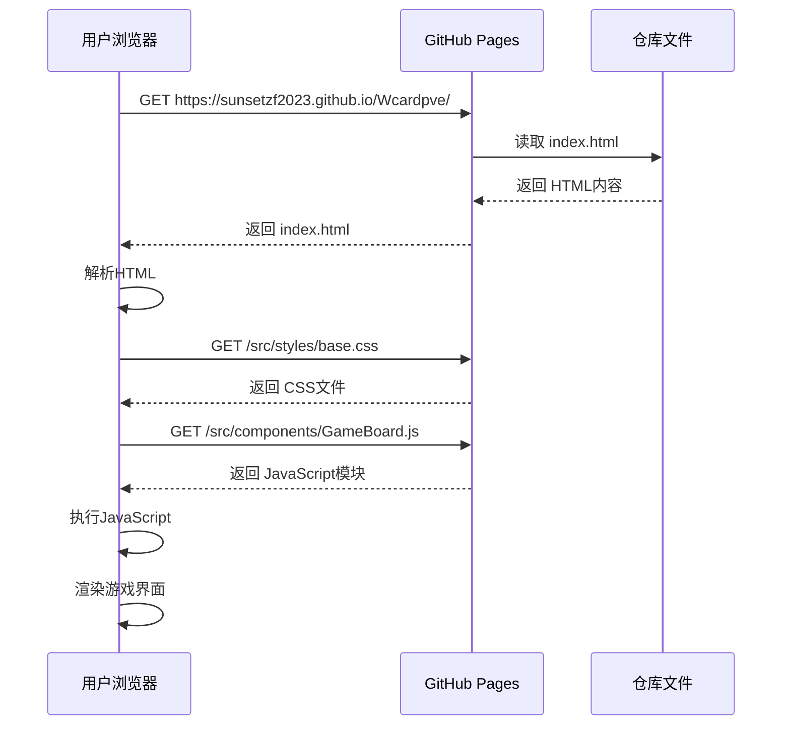

# GitHub Pages 工作原理详解

## 🔍 解析和执行流程

### 第1步：文件部署
```
您的仓库 → GitHub服务器 → CDN分发
```

当您推送代码到GitHub后：
1. GitHub检测到Pages设置
2. 将仓库文件复制到Pages服务器
3. 通过CDN全球分发

### 第2步：用户访问
```
用户浏览器 → 请求URL → GitHub Pages → 返回HTML文件
```

用户访问 `https://sunsetzf2023.github.io/Wcardpve/` 时：
1. 浏览器发送HTTP请求
2. GitHub Pages返回 `public/index.html`（或根目录的 `index.html`）
3. 浏览器开始解析HTML

### 第3步：HTML解析
```html
<!-- 浏览器按顺序解析 -->
<!DOCTYPE html>
<html>
<head>
    <!-- 1. 加载CSS样式 -->
    <link rel="stylesheet" href="/src/styles/base.css">
    <link rel="stylesheet" href="/src/styles/components.css">
</head>
<body>
    <!-- 2. 创建DOM结构 -->
    <div id="app">
        <div class="loading-screen">...</div>
    </div>
    
    <!-- 3. 执行JavaScript -->
    <script type="module">
        import { GameBoard } from '/src/components/GameBoard.js';
        // ... 游戏逻辑
    </script>
</body>
</html>
```

### 第4步：资源加载
```
index.html
├── /src/styles/base.css        → 加载样式
├── /src/styles/components.css  → 加载组件样式
└── /src/components/GameBoard.js → 执行JavaScript模块
```

浏览器会：
1. 并行下载CSS文件
2. 解析CSS规则
3. 下载JavaScript模块
4. 执行JavaScript代码

## 🎯 关键技术点

### 1. **ES6模块系统**
```javascript
// 浏览器原生支持ES6模块
import { GameBoard } from '/src/components/GameBoard.js';
import { GameEngine } from '/src/services/GameEngine.js';
```

- 无需构建工具（如Webpack、Rollup）
- 浏览器直接解析 `import/export`
- 按需加载模块

### 2. **相对路径解析**
```
仓库结构：
├── public/
│   └── index.html
└── src/
    ├── components/
    │   └── GameBoard.js
    └── styles/
        └── base.css
```

在浏览器中：
- `/src/components/GameBoard.js` → `https://sunsetzf2023.github.io/Wcardpve/src/components/GameBoard.js`
- `/src/styles/base.css` → `https://sunsetzf2023.github.io/Wcardpve/src/styles/base.css`

### 3. **MIME类型处理**
GitHub Pages自动设置正确的MIME类型：
- `.html` → `text/html`
- `.css` → `text/css`
- `.js` → `application/javascript`
- `.json` → `application/json`

## 🚀 执行时序

### 浏览器渲染流程


### JavaScript执行顺序
```javascript
// 1. DOM加载完成
document.addEventListener('DOMContentLoaded', () => {
    
    // 2. 导入模块
    import { GameBoard } from '/src/components/GameBoard.js';
    import { GameEngine } from '/src/services/GameEngine.js';
    
    // 3. 初始化应用
    const app = new CardBattleApp();
    
    // 4. 加载游戏数据
    await app.init();
    
    // 5. 启动游戏
    app.startGame();
});
```

## 🔧 技术限制和解决方案

### 限制1：无服务器端处理
- ❌ 不能运行Node.js代码
- ❌ 不能连接数据库
- ❌ 不能使用服务器API

✅ **解决方案**：
- 使用LocalStorage存储游戏进度
- 使用客户端JavaScript处理所有逻辑
- 使用JSON文件存储静态数据

### 限制2：文件系统访问
- ❌ 不能读取本地文件
- ❌ 不能写入文件
- ❌ 不能访问操作系统

✅ **解决方案**：
- 使用Fetch API加载JSON数据
- 使用LocalStorage保存用户数据
- 使用IndexedDB存储大量数据

### 限制3：跨域限制
- ❌ 不能直接访问外部API
- ❌ 受CORS政策限制

✅ **解决方案**：
- 使用支持CORS的API
- 使用JSONP（如果需要）
- 使用代理服务（如果必须）

## 🎮 游戏数据加载

### JSON文件加载
```javascript
// 在CardManager.js中
async loadCards() {
    try {
        const response = await fetch('/src/data/cards.json');
        const cardsData = await response.json();
        this.cards = cardsData.cards.map(cardData => new Card(cardData));
    } catch (error) {
        console.error('Failed to load cards:', error);
    }
}
```

### 浏览器请求过程
```
1. JavaScript调用 fetch('/src/data/cards.json')
2. 浏览器发送 GET 请求到 GitHub Pages
3. GitHub Pages返回 cards.json 文件内容
4. JavaScript解析JSON并创建Card对象
```

## 📊 性能优化

### 1. **缓存策略**
GitHub Pages自动设置缓存：
- HTML文件：短期缓存
- CSS/JS文件：长期缓存
- 图片文件：长期缓存

### 2. **CDN加速**
- 全球CDN节点
- 就近访问
- 快速加载

### 3. **Gzip压缩**
- 自动压缩文本文件
- 减少传输大小
- 提高加载速度

## 🛠️ 调试技巧

### 1. **浏览器开发者工具**
```javascript
// 在浏览器控制台中
window.gameApp.gameEngine.getGameState()
window.gameApp.gameBoard
```

### 2. **网络面板**
- 查看文件加载顺序
- 检查加载时间
- 发现错误请求

### 3. **控制台错误**
- JavaScript语法错误
- 文件加载失败
- 模块导入错误

## 🎯 总结

GitHub Pages的工作原理：
1. **静态托管** - 直接提供文件访问
2. **浏览器执行** - 所有逻辑在客户端运行
3. **模块化加载** - ES6模块按需导入
4. **无服务器** - 纯前端解决方案

这就是为什么您的游戏能在GitHub Pages上运行的原因！
