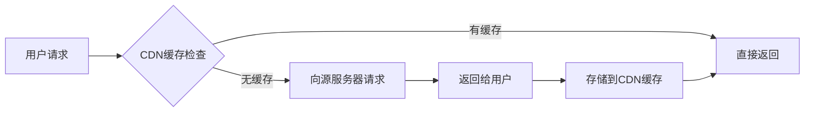
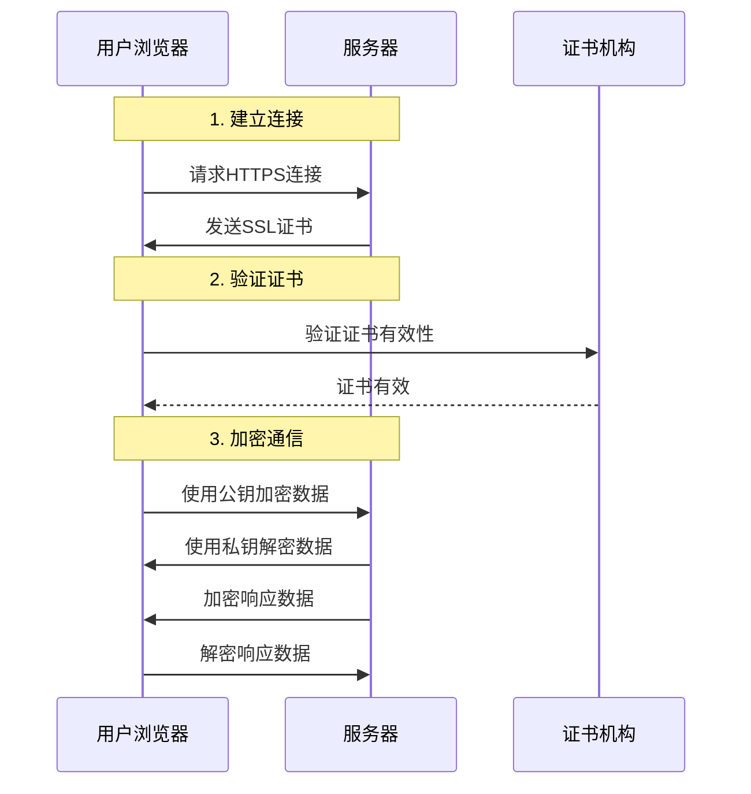

# 网络基础概念详解

## 🌐 CDN (Content Delivery Network) 内容分发网络

### 📦 什么是CDN？
CDN是**内容分发网络**，就像在全球各地建立"仓库"，存放您的网站文件。

### 🏢 CDN架构
```
原始服务器 (GitHub)
    ↓
全球CDN节点
├── 🇺🇸 美国服务器
├── 🇨🇳 中国服务器  
├── 🇯🇵 日本服务器
├── 🇬🇧 英国服务器
├── 🇩🇪 德国服务器
└── 🇦🇺 澳大利亚服务器
    ↓
用户就近访问
```

### ⚡ CDN工作流程

#### 传统方式（无CDN）
```
用户请求 → 远程服务器 → 返回内容
🇨🇳用户 → 🇺🇸GitHub → 慢速传输
```

#### CDN方式
```
用户请求 → 最近CDN节点 → 快速返回
🇨🇳用户 → 🇨🇳CDN节点 → 快速传输
```

### 🎯 CDN的优势

#### 1. **速度提升**
- **减少延迟**：物理距离更近
- **带宽更宽**：多节点分担负载
- **响应更快**：通常快10-100倍

#### 2. **稳定性增强**
- **负载均衡**：分散用户请求
- **故障转移**：节点故障自动切换
- **高可用性**：99.9%+在线时间

#### 3. **成本优化**
- **带宽节省**：减少源服务器负载
- **扩展性强**：轻松应对流量峰值
- **全球覆盖**：一次部署，全球访问

### 🔍 CDN缓存机制



#### 缓存策略
- **静态文件**：长期缓存（CSS、JS、图片）
- **动态内容**：短期缓存或不缓存
- **更新机制**：自动检测文件变化

### 🎮 对您游戏的影响

#### 无CDN的问题
```javascript
// 🇨🇳用户访问
fetch('https://github.com/your-game/assets/style.css')
// → 延迟：500-2000ms
// → 可能失败：网络限制
```

#### 有CDN的优势
```javascript
// 🇨🇳用户访问
fetch('https://cdn.github.com/your-game/assets/style.css')
// → 延迟：50-200ms
// → 稳定可靠
```

---

## 🔒 HTTP vs HTTPS 协议对比

### 📋 基本概念

#### HTTP (HyperText Transfer Protocol)
- **明文传输**：数据不加密
- **端口**：80
- **安全性**：❌ 不安全
- **速度**：⚡ 稍快（无加密开销）

#### HTTPS (HTTP Secure)
- **加密传输**：数据加密保护
- **端口**：443
- **安全性**：✅ 安全
- **速度**：🐢 稍慢（加密开销）

### 🔐 HTTPS加密原理



### 🛡️ 安全性对比

#### HTTP的风险
```javascript
// ❌ HTTP - 明文传输
GET /login?username=admin&password=123456
// → 网络上任何人都能看到密码
// → 容易被中间人攻击
// → 数据可能被篡改
```

#### HTTPS的保护
```javascript
// ✅ HTTPS - 加密传输
GET /login?username=admin&password=123456
// → 数据加密传输
// → 防止中间人攻击
// → 数据完整性保护
```

### 📊 详细对比表

| 特性 | HTTP | HTTPS |
|------|-------|--------|
| **安全性** | ❌ 不安全 | ✅ 安全 |
| **加密** | ❌ 无加密 | ✅ SSL/TLS加密 |
| **端口** | 80 | 443 |
| **证书** | ❌ 不需要 | ✅ 需要SSL证书 |
| **速度** | ⚡ 稍快 | 🐢 稍慢 |
| **SEO** | 🔻 排名较低 | 🔺 排名较高 |
| **浏览器信任** | ⚠️ 显示"不安全" | ✅ 显示安全锁 |
| **成本** | 免费 | 证书费用（现在大多免费） |

### 🌐 现代Web趋势

#### HTTPS成为标准
- **Google推动**：HTTPS网站排名更高
- **浏览器强制**：Chrome标记HTTP为不安全
- **新特性要求**：HTTP/2、Service Worker等需要HTTPS
- **用户信任**：用户更信任HTTPS网站

#### GitHub Pages自动HTTPS
```javascript
// 您的网站自动支持HTTPS
https://sunsetzf2023.github.io/Wcardpve/
// ✅ 安全连接
// ✅ 现代浏览器特性
// ✅ 用户信任
```

### 🚀 性能影响

#### 速度差异
```
HTTP:  用户 → 服务器 (100ms)
HTTPS: 用户 → 加密 → 服务器 → 解密 (120ms)
```

**差异很小**，现代硬件和优化算法让HTTPS几乎无感知延迟。

#### HTTP/2优势
HTTPS可以使用HTTP/2协议：
- **多路复用**：同时传输多个文件
- **头部压缩**：减少数据传输量
- **服务器推送**：主动推送资源

**结果**：HTTPS + HTTP/2 实际上比HTTP更快！

### 🔧 开发中的注意事项

#### 混合内容问题
```html
<!-- ❌ 错误：HTTPS页面加载HTTP资源 -->
<script src="http://example.com/script.js"></script>
<!-- → 浏览器阻止加载 -->

<!-- ✅ 正确：使用HTTPS资源 -->
<script src="https://example.com/script.js"></script>
```

#### 本地开发
```javascript
// 开发环境
http://localhost:8000  // HTTP允许

// 生产环境
https://sunsetzf2023.github.io/Wcardpve/  // HTTPS强制
```

### 🎮 对您游戏的影响

#### 安全性
```javascript
// 用户游戏数据
fetch('/api/save-game', {
    method: 'POST',
    body: JSON.stringify(gameData)
});
// HTTPS保护：防止游戏数据被窃取
```

#### 现代特性
```javascript
// Service Worker (离线支持)
if ('serviceWorker' in navigator) {
    navigator.serviceWorker.register('/sw.js');
}
// 需要HTTPS才能工作
```

#### 用户信任
```
🔒 HTTPS网站 → 用户愿意注册和付费
⚠️ HTTP网站 → 用户担心安全问题
```

---

## 📝 总结

### CDN的核心价值
- **速度**：全球就近访问
- **稳定**：高可用性保证
- **扩展**：轻松应对流量

### HTTPS的核心价值
- **安全**：数据加密保护
- **信任**：用户信心建立
- **现代**：支持最新Web特性

### 对您的意义
您的游戏通过GitHub Pages获得：
- ✅ **全球CDN加速** - 世界各地用户快速访问
- ✅ **自动HTTPS** - 安全连接和现代特性
- ✅ **零成本部署** - 免费的高性能服务

这就是为什么您的游戏能快速、安全地运行在全球用户面前！
